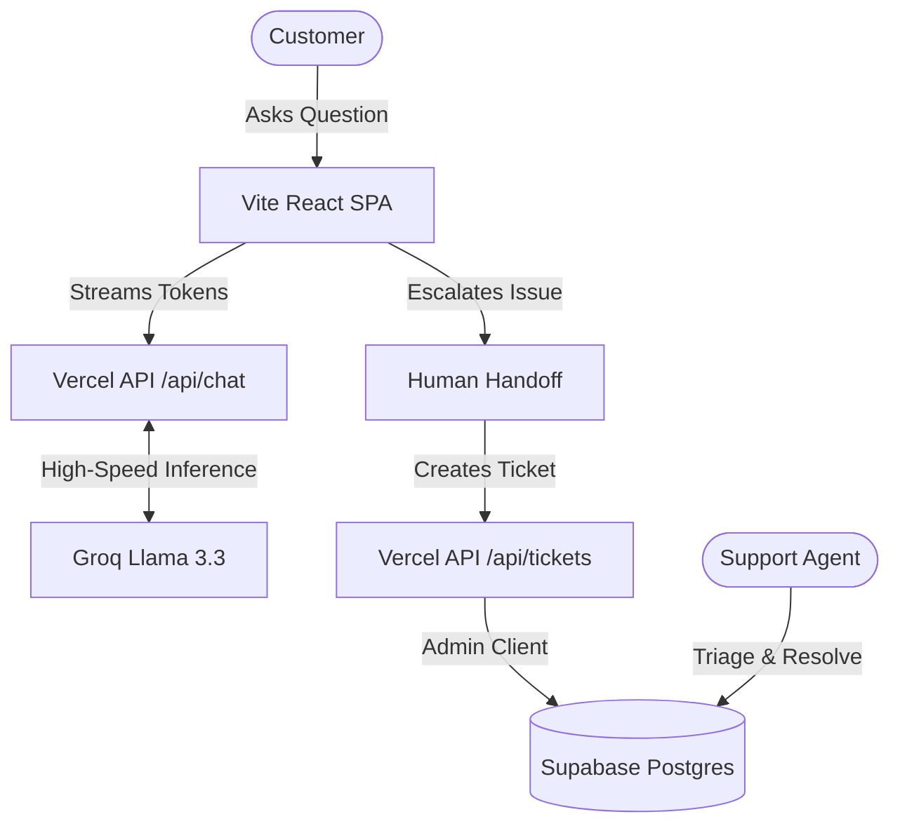

# 🎧 NovaHelp

> A modern, AI-first customer support workspace designed for rapid issue resolution and seamless human handoff. Built for speed, scale, and an exceptional user experience.

[](https://vitejs.dev)
[](https://react.dev)
[](https://groq.com)
[](https://supabase.com)
[](https://clerk.com)
[](https://vercel.com)

---

## ✨ Overview

NovaHelp bridges the gap between automated AI support and authentic human assistance.

It combines:

* ⚡ Ultra-low latency AI chat
* 🎫 Human escalation & ticketing
* 🧠 Specialized AI support personas
* 👥 Role-based operational dashboards
* 📄 Exportable conversation transcripts
* 🔄 Real-time collaboration

into a single cohesive support platform.

---

## ✨ Core Features

### 🤖 High-Speed AI Chat Assistant

Specialist personas for:

* Billing
* Technical Support
* Customer Onboarding

Powered by Groq’s lightning-fast Llama 3.3 inference.

### 🔁 Intelligent Handoff & Deflection

Automates routine customer queries while allowing seamless escalation to live human representatives.

Conversation context is persisted directly into support tickets.

### 🧑‍💼 Role-Based Workspaces

#### Customer Portal (`/`)

* Chat with AI assistant
* View ticket status
* Request human support

#### Agent Console (`/staff`)

* Claim tickets
* Respond to users
* Manage support queue

#### Admin Dashboard (`/admin`)

* Monitor all tickets
* Manage agents
* Access operational analytics

### 📄 Exportable Transcripts

One-click export of conversations into:

* PDF
* Markdown

### 🔴 Real-Time Sync

Live updates powered by Supabase realtime subscriptions.

---

## 📐 Architecture Flow



---

## 🚀 Demo Accounts

For hackathon examiners and reviewers, pre-configured demo accounts are available.

| Role  | Email                     | Password        | Route          |
| ----- | ------------------------- | --------------- | -------------- |
| User  | `demo.user@novahelp.app`  | `DemoPass!2026` | `/login`       |
| Agent | `demo.agent@novahelp.app` | `DemoPass!2026` | `/agent-login` |
| Admin | `demo.admin@novahelp.app` | `DemoPass!2026` | `/agent-login` |

---

## 🧱 Tech Stack

| Layer          | Technology                               |
| -------------- | ---------------------------------------- |
| Framework      | Vite 7 + React 19 (SPA)                  |
| Routing        | TanStack Router                          |
| Styling        | Tailwind CSS v4 + shadcn/ui              |
| Authentication | Clerk (`@clerk/clerk-react`)             |
| Database       | Supabase Postgres                        |
| AI Inference   | Groq SDK (`llama-3.3-70b-versatile`)     |
| Deployment     | Vercel (static SPA + serverless API)     |
| Language       | TypeScript                               |

---

## 📁 Project Structure

```plaintext
index.html                 # Vite SPA entry
vercel.json                # SPA routing rewrites

api/
├── chat.ts                # Groq streaming chat (serverless)
├── tickets.ts             # Ticket & staff operations (serverless)
└── lib/                   # Shared server handlers

src/
├── main.tsx               # React mount + RouterProvider
├── routes/
│   ├── index.tsx          # /
│   ├── login.tsx          # /login
│   ├── agent-login.tsx    # /agent-login
│   ├── staff.tsx          # /staff
│   └── admin.tsx          # /admin
├── components/            # Reusable UI components
├── lib/
│   ├── tickets.functions.ts  # Client API wrappers
│   ├── personas.ts
│   └── pdf-export.ts
└── integrations/
    └── supabase/          # Supabase client & types

supabase/
└── migrations/
```

---

## 🛠️ Local Development

Clone the repository:

```bash
git clone https://github.com/your-username/novahelp.git
cd novahelp
```

Install dependencies:

```bash
npm install
```

Create a `.env` file (see [Environment Variables](#-environment-variables) below), then start the dev server:

```bash
npm run dev
```

The Vite dev server serves the React SPA and proxies `/api/chat` and `/api/tickets` locally via middleware, so API routes work without `vercel dev`.

Build for production:

```bash
npm run build
npm run preview
```

---

## 🔐 Environment Variables

Create a `.env` file in the root directory:

```env
# Clerk Authentication
VITE_CLERK_PUBLISHABLE_KEY=
CLERK_SECRET_KEY=

# Supabase Database (client — exposed to browser via Vite)
VITE_SUPABASE_URL=
VITE_SUPABASE_PUBLISHABLE_KEY=

# Supabase Database (server — API routes only, never expose to client)
SUPABASE_URL=
SUPABASE_SERVICE_ROLE_KEY=

# AI Inference (server — API routes only)
GROQ_API_KEY=
```

On Vercel, set the same variables in **Project Settings → Environment Variables**. Prefix `VITE_*` variables must be available at build time.

---

## 🔒 Security & Access Control

### ✅ Server-Side Authorization

All staff/admin validation occurs server-side in Vercel API routes using the Supabase service role client.

### ✅ Data Isolation

Roles are stored separately in a dedicated `staff` table.

### ✅ Row Level Security (RLS)

RLS policies are enforced at the database level for all public tables.

### ✅ Secure Authentication

Clerk handles user authentication; sensitive keys (`GROQ_API_KEY`, `SUPABASE_SERVICE_ROLE_KEY`) never reach the browser.

---

## 🌍 Deployment

NovaHelp is deployed as a **Vite static SPA** with **Vercel serverless functions** for API routes.

### Vercel settings

| Setting           | Value           |
| ----------------- | --------------- |
| Build Command     | `npm run build` |
| Output Directory  | `dist`          |
| Install Command   | `npm install`   |

### SPA routing

`vercel.json` rewrites all non-API paths to `/index.html`, so client routes work on refresh:

* `/`
* `/login`
* `/agent-login`
* `/staff`
* `/admin`

Vercel automatically serves `/api/chat` and `/api/tickets` as serverless functions — these take precedence over SPA rewrites.

### Deploy

```bash
git push origin main   # if Vercel is connected to the repo
# or
npx vercel --prod
```

---

## 📜 License

Developed by **Tanmay Tripathi** for hackathon submission.

Free to fork, adapt, and build upon.
