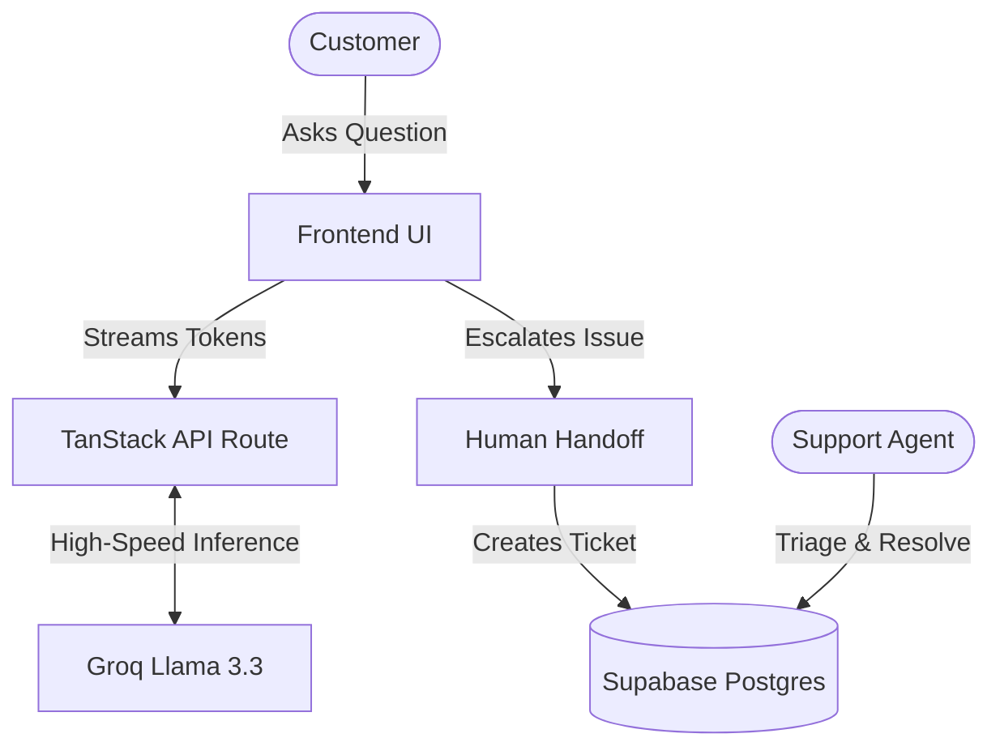

# 🎧 NovaHelp

> A modern, AI-first customer support workspace designed for rapid issue resolution and seamless human handoff. Built for speed, scale, and an exceptional user experience.

[](https://tanstack.com/start)
[](https://groq.com)
[](https://supabase.com)
[](https://clerk.com)

---

## ✨ Overview

NovaHelp bridges the gap between automated AI support and authentic human assistance.

It combines:

* ⚡ Ultra-low latency AI chat
* 🎫 Human escalation & ticketing
* 🧠 Specialized AI support personas
* 👥 Role-based operational dashboards
* 📄 Exportable conversation transcripts
* 🔄 Real-time collaboration

into a single cohesive support platform.

---

## ✨ Core Features

### 🤖 High-Speed AI Chat Assistant

Specialist personas for:

* Billing
* Technical Support
* Customer Onboarding

Powered by Groq’s lightning-fast Llama 3.3 inference.

### 🔁 Intelligent Handoff & Deflection

Automates routine customer queries while allowing seamless escalation to live human representatives.

Conversation context is persisted directly into support tickets.

### 🧑‍💼 Role-Based Workspaces

#### Customer Portal (`/`)

* Chat with AI assistant
* View ticket status
* Request human support

#### Agent Console (`/staff`)

* Claim tickets
* Respond to users
* Manage support queue

#### Admin Dashboard (`/admin`)

* Monitor all tickets
* Manage agents
* Access operational analytics

### 📄 Exportable Transcripts

One-click export of conversations into:

* PDF
* Markdown

### 🔴 Real-Time Sync

Live updates powered by Supabase realtime subscriptions.

---

## 📐 Architecture Flow



---

## 🚀 Demo Accounts

For hackathon examiners and reviewers, pre-configured demo accounts are available.

| Role  | Email                     | Password        | Route          |
| ----- | ------------------------- | --------------- | -------------- |
| User  | `demo.user@novahelp.app`  | `DemoPass!2026` | `/login`       |
| Agent | `demo.agent@novahelp.app` | `DemoPass!2026` | `/agent-login` |
| Admin | `demo.admin@novahelp.app` | `DemoPass!2026` | `/agent-login` |

---

## 🧱 Tech Stack

| Layer          | Technology                               |
| -------------- | ---------------------------------------- |
| Framework      | TanStack Start (React 19 + Vite 7 + SSR) |
| Styling        | Tailwind CSS v4 + shadcn/ui              |
| Authentication | Clerk                                    |
| Database       | Supabase Postgres                        |
| AI Inference   | Groq SDK (`llama-3.3-70b-versatile`)     |
| Deployment     | Cloudflare Workers                       |
| Language       | TypeScript                               |

---

## 📁 Project Structure

```plaintext
src/
├── routes/
│   ├── index.tsx
│   ├── login.tsx
│   ├── agent-login.tsx
│   ├── staff.tsx
│   ├── admin.tsx
│   └── api/chat.ts

├── components/
│   └── reusable UI components

├── lib/
│   ├── tickets.functions.ts
│   ├── personas.ts
│   └── pdf-export.ts

└── integrations/
    └── generated clients

supabase/
└── migrations/
```

---

## 🛠️ Local Development

Clone the repository:

```bash
git clone https://github.com/your-username/novahelp.git
cd novahelp
```

Install dependencies:

```bash
npm install
```

Start development server:

```bash
npm run dev
```

---

## 🔐 Environment Variables

Create a `.env` file in the root directory:

```env
# Clerk Authentication
VITE_CLERK_PUBLISHABLE_KEY=
CLERK_SECRET_KEY=

# Supabase Database
VITE_SUPABASE_URL=
VITE_SUPABASE_PUBLISHABLE_KEY=
SUPABASE_SERVICE_ROLE_KEY=

# AI Inference
GROQ_API_KEY=
```

---

## 🔒 Security & Access Control

### ✅ Server-Side Authorization

All staff/admin validation occurs server-side using secure SQL functions.

### ✅ Data Isolation

Roles are stored separately in a dedicated `staff` table.

### ✅ Row Level Security (RLS)

RLS policies are enforced at the database level for all public tables.

### ✅ Secure Authentication

Webhook signatures and protected routes are verified before execution.

---

## 🌍 Deployment

NovaHelp is optimized for edge deployment using Cloudflare Workers.

Recommended platforms:

* Cloudflare Workers
* Vercel
* Netlify

---

## 📜 License

Developed by **Tanmay Tripathi** for hackathon submission.

Free to fork, adapt, and build upon.
